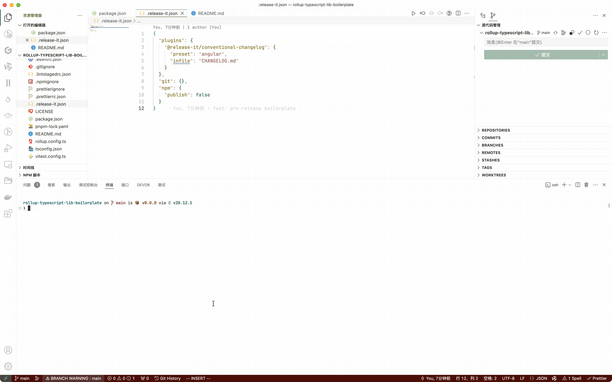
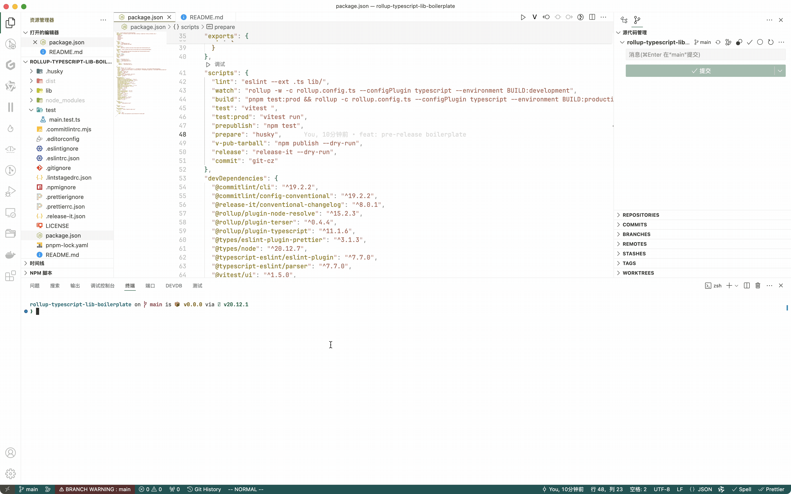
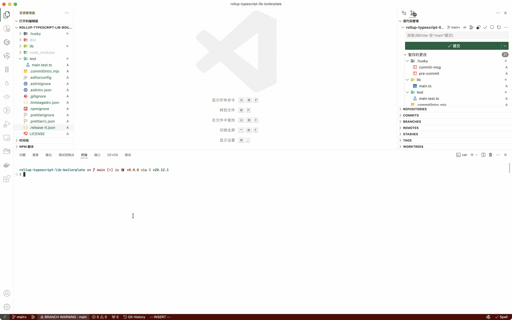
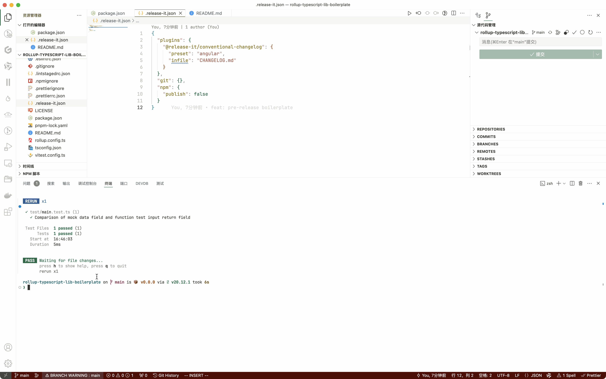
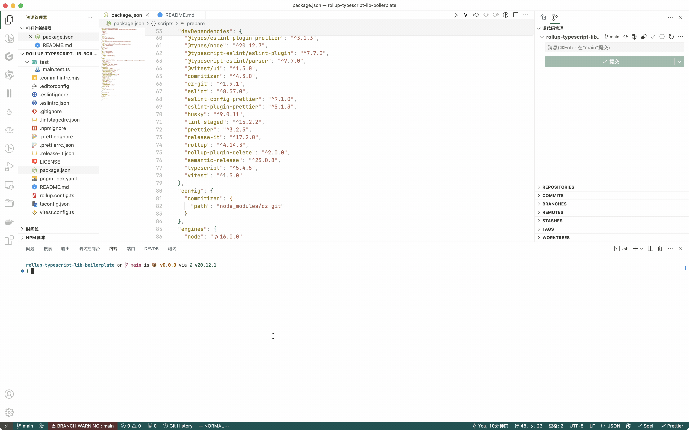
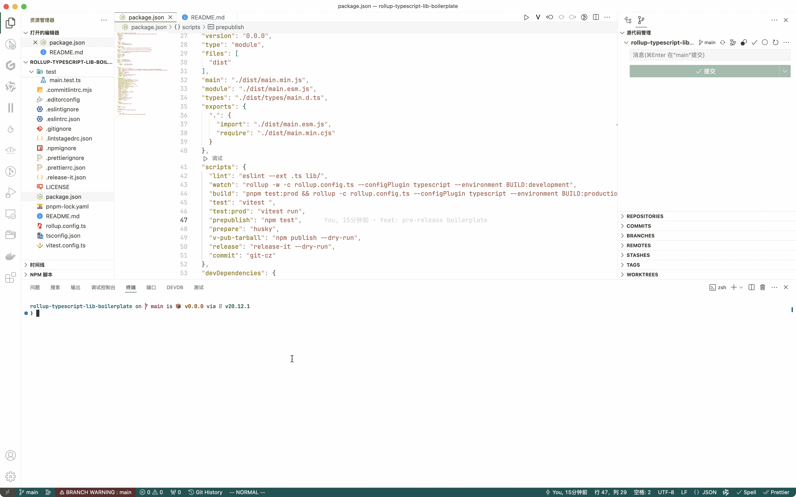

## npm-scripts-intro

Demonstrate the execution of several commands in the project

### dev mode

rollup build lib( watch mode )

### build mode

rollup build lib (minify)

### conventional commits

angular conventional commits (interactive)

### unit tests

use vitest

#### watch mode

Run all test suites but watch for changes and rerun tests when they change.

#### product mode (once)

Perform a single run without watch mode.

### npm publish tarball (local view)

`npm publish --dry-run` (view tarball)

### release-it

release-it is interactive and allows you to confirm each task before execution:

